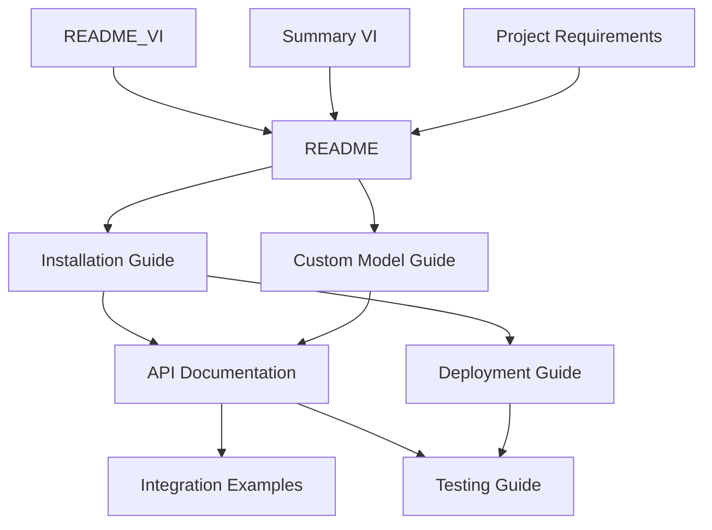

# 📖 **Documentation Index**

## 🏠 **AI Backend Hub Documentation**

Welcome to the comprehensive documentation for AI Backend Hub - your local AI infrastructure solution.

---

## 📚 **Documentation Structure**

### **📋 Core Documentation**

| Document | Description | Audience |
|----------|-------------|----------|
| **[README](README.md)** | Project overview và quick start | All users |
| **[README_VI](README_VI.md)** | Vietnamese version của README | Vietnamese users |
| **[Project Requirements](promt.md)** | Complete project vision và status | Developers, PMs |

### **🛠️ Setup & Installation**

| Document | Description | Audience |
|----------|-------------|----------|
| **[Installation Guide](INSTALLATION_GUIDE.md)** | Complete setup instructions | DevOps, Developers |
| **[Custom Model Guide](CUSTOM_MODEL_GUIDE.md)** | Model management and setup | AI Engineers |

### **🔧 Technical Documentation**

| Document | Description | Audience |
|----------|-------------|----------|
| **[API Documentation](API_DOCUMENTATION.md)** | Complete API reference | Frontend Developers |
| **[Testing Guide](TESTING_GUIDE.md)** | Testing strategies và examples | QA Engineers |
| **[Deployment Guide](DEPLOYMENT_GUIDE.md)** | Production deployment | DevOps Engineers |

### **🤝 Integration & Examples**

| Document | Description | Audience |
|----------|-------------|----------|
| **[Integration Examples](INTEGRATION_EXAMPLES.md)** | Framework-specific examples | Full-stack Developers |

### **📊 Additional Resources**

| Document | Description | Audience |
|----------|-------------|----------|
| **[Summary VI](SUMMARY_VI.md)** | Vietnamese project summary | Vietnamese stakeholders |
| **[Troubleshooting Guide](TROUBLESHOOTING_GUIDE.md)** | Common issues & solutions | All users |
| **[FAQ](FAQ.md)** | Frequently asked questions | All users |

---

## 🚀 **Quick Navigation**

### **👋 New to AI Backend Hub?**
1. Start with **[README](README.md)** for overview
2. Follow **[Installation Guide](INSTALLATION_GUIDE.md)** for setup
3. Read **[Custom Model Guide](CUSTOM_MODEL_GUIDE.md)** for model management
4. Explore **[API Documentation](API_DOCUMENTATION.md)** for integration

### **🏗️ For Developers**
1. **[API Documentation](API_DOCUMENTATION.md)** - Complete API reference
2. **[Integration Examples](INTEGRATION_EXAMPLES.md)** - Framework examples
3. **[Testing Guide](TESTING_GUIDE.md)** - Testing strategies
4. **[Deployment Guide](DEPLOYMENT_GUIDE.md)** - Production deployment

### **🔧 For DevOps Engineers**
1. **[Installation Guide](INSTALLATION_GUIDE.md)** - System setup
2. **[Deployment Guide](DEPLOYMENT_GUIDE.md)** - Production deployment
3. **[Testing Guide](TESTING_GUIDE.md)** - Automated testing

### **🤖 For AI Engineers**
1. **[Custom Model Guide](CUSTOM_MODEL_GUIDE.md)** - Model management
2. **[API Documentation](API_DOCUMENTATION.md)** - Training endpoints
3. **[Project Requirements](promt.md)** - Technical specifications

---

## 📖 **Document Relationships**



---

## 🎯 **Documentation Features**

### **✅ What's Covered**

- **Complete Setup Process** - From development to production
- **API Reference** - All endpoints với examples
- **Integration Patterns** - React, Python, Node.js, Mobile
- **Model Management** - Local models, training, optimization
- **Testing Strategies** - Unit, integration, performance tests
- **Deployment Options** - Docker, Kubernetes, bare metal
- **Security Guidelines** - Authentication, authorization, best practices
- **Performance Optimization** - VRAM management, caching, scaling

### **🌟 Special Features**

- **Bilingual Support** - English và Vietnamese documentation
- **Code Examples** - Ready-to-use code snippets
- **Interactive Guides** - Step-by-step instructions
- **Production Ready** - Enterprise deployment patterns
- **Community Focused** - Open source best practices

---

## 💡 **How to Use This Documentation**

### **📚 Reading Path by Role**

**🆕 Beginner Path:**
```
README → Installation Guide → Custom Model Guide → API Documentation
```

**👩‍💻 Developer Path:**
```
API Documentation → Integration Examples → Testing Guide
```

**🔧 DevOps Path:**
```
Installation Guide → Deployment Guide → Testing Guide
```

**🤖 AI Engineer Path:**
```
Custom Model Guide → Project Requirements → API Documentation
```

### **🔍 Finding Information**

- **Search Keywords**: Use Ctrl+F với specific terms
- **Cross References**: Follow links between documents
- **Code Examples**: Look for ```code blocks``` for implementation
- **Troubleshooting**: Check each guide's troubleshooting section

---

## 🤝 **Contributing to Documentation**

### **📝 Documentation Standards**

- **Clear Headings** - Use emoji và descriptive titles
- **Code Examples** - Always include working examples
- **Cross-References** - Link related sections
- **Version Control** - Keep docs updated với code changes
- **Bilingual Support** - Consider Vietnamese translations

### **🛠️ Making Updates**

1. **Edit Markdown Files** - Use your favorite editor
2. **Test Examples** - Verify all code examples work
3. **Update Index** - Modify this file if adding new docs
4. **Submit Changes** - Follow git workflow

---

## 📞 **Getting Help**

### **🐛 Issues & Questions**

- **Check Documentation** - Search this documentation first
- **GitHub Issues** - Create issue for bugs or feature requests
- **Community Support** - Join discussions
- **Vietnamese Support** - Tham khảo [README_VI](README_VI.md)

### **📧 Contact Information**

- **Project Maintainer**: AI Backend Hub Team
- **Repository**: [GitHub Repository URL]
- **License**: Open Source (Check LICENSE file)

---

## 🏷️ **Document Versions**

| Document | Last Updated | Version | Status |
|----------|--------------|---------|--------|
| README.md | 2024-01-01 | 1.0.0 | ✅ Current |
| API_DOCUMENTATION.md | 2024-01-01 | 1.0.0 | ✅ Current |
| INSTALLATION_GUIDE.md | 2024-01-01 | 1.0.0 | ✅ Current |
| DEPLOYMENT_GUIDE.md | 2024-01-01 | 1.0.0 | ✅ Current |
| TESTING_GUIDE.md | 2024-01-01 | 1.0.0 | ✅ Current |
| INTEGRATION_EXAMPLES.md | 2024-01-01 | 1.0.0 | ✅ Current |
| CUSTOM_MODEL_GUIDE.md | 2024-01-01 | 1.0.0 | ✅ Current |
| TROUBLESHOOTING_GUIDE.md | 2024-01-01 | 1.0.0 | ✅ Current |
| FAQ.md | 2024-01-01 | 1.0.0 | ✅ Current |

---

## 🎉 **Documentation Complete**

**All documentation is ready và comprehensive for AI Backend Hub!**

- ✅ **7 Complete Guides** - From setup to production
- ✅ **Bilingual Support** - English & Vietnamese
- ✅ **Framework Examples** - React, Python, Node.js, Mobile
- ✅ **Production Ready** - Enterprise deployment patterns
- ✅ **Community Focused** - Open source best practices

**Start exploring và building với AI Backend Hub today!** 🚀
